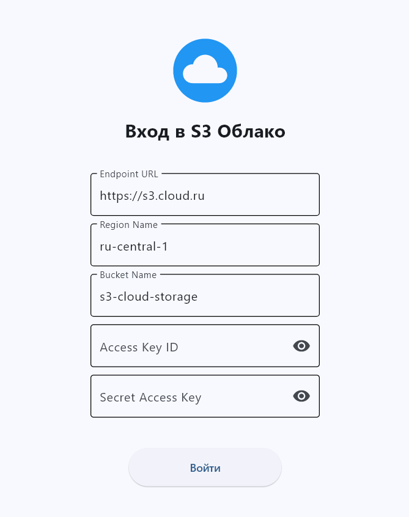
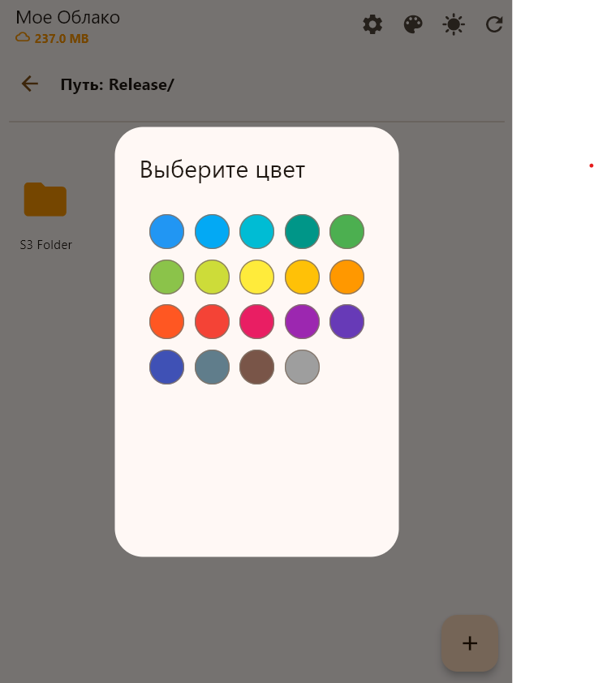
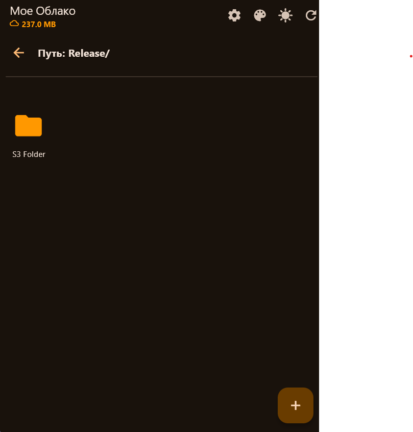

# S3PrivateCloud
S3 Private Cloud manager.  A vendor-agnostic, cross-platform S3 client built with Flet/Python. Connect to AWS, MinIO, or any S3 provider with zero tracking and full data sovereignty.
Your Data, Your Rules. A lightweight, cross-platform client designed for complete independence and total control over your digital assets.

Unlike proprietary cloud apps that lock you into a single ecosystem, S3 Freedom Manager is a vendor-agnostic tool built to work with any S3-compatible storage provider. Whether you use enterprise giants like AWS, local providers like Cloud.ru/Yandex, or self-hosted solutions like MinIO on your own home server — this app gives you a unified, secure interface to manage your files.

🛡️ Key Philosophies
🚫 No Vendor Lock-In: Switch providers instantly without changing your workflow. Your data is not tied to this app; we simply provide the window to view it.

🔒 Zero-Knowledge Privacy: We don't run a backend server. Your Access Keys and Secret Keys are stored locally on your device using secure client storage. No middleman sees your credentials.

🏠 Self-Hosted Ready: Perfect for privacy enthusiasts running private clouds (NAS/MinIO). Keep your data physically within your control while enjoying a modern mobile/desktop UI.

⚡ Direct Connection: All file transfers happen directly between your device and your storage bucket. No proxy servers, no throttling, no hidden data harvesting.

Take back control of your cloud storage.
# ☁️ S3 Cloud Manager (Flet)

Кроссплатформенный клиент для управления S3-хранилищами (AWS, Yandex Cloud, Cloud.ru, MinIO), написанный на Python с использованием фреймворка [Flet](https://flet.dev).

Позволяет просматривать файлы, создавать папки, загружать данные, менять цветовые метки папок и скачивать файлы на любых устройствах.

---

### 📥 Скачать приложение

| Платформа | Статус | Версия | Ссылка |
| :--- | :---: | :---: | :--- |
| **Android** |  | v1.0.0 | [**Скачать .apk**](https://github.com/SwordBird2002/S3PrivateCloud/releases) |
| **Windows** |  | v1.0.0 | [**Скачать .exe**](https://github.com/SwordBird2002/S3PrivateCloud/releases) |

---

### 📸 Скриншоты

| Экран входа | Файловый менеджер | Темная тема |
| :---: | :---: | :---: |
|  |  |  |

---

### ✨ Возможности

*   🔐 **Безопасная авторизация:** Поддержка Access Key / Secret Key, выбор региона и Endpoint. Данные входа сохраняются в защищенном хранилище устройства.
*   📂 **Файловый менеджер:**
    *   Просмотр структуры папок и файлов.
    *   Отображение размера файлов и общего занятого места.
    *   Иконки для разных типов файлов (изображения, видео, код, архивы).
*   🎨 **Персонализация:**
    *   Возможность менять цвет и подпись для любой папки.
    *   Светлая и Темная тема интерфейса.
    *   Выбор основного цвета приложения (Color Seed).
*   🚀 **Загрузка и Скачивание:**
    *   Мульти-загрузка файлов.
    *   Фоновая загрузка без зависания интерфейса.
    *   Скачивание файлов через Presigned URL (работает на Android 10+ без лишних разрешений).
*   ⚙️ **Управление:**
    *   Создание и удаление папок.
    *   Удаление файлов.
    *   Настройка "Стартовой папки" при входе.
